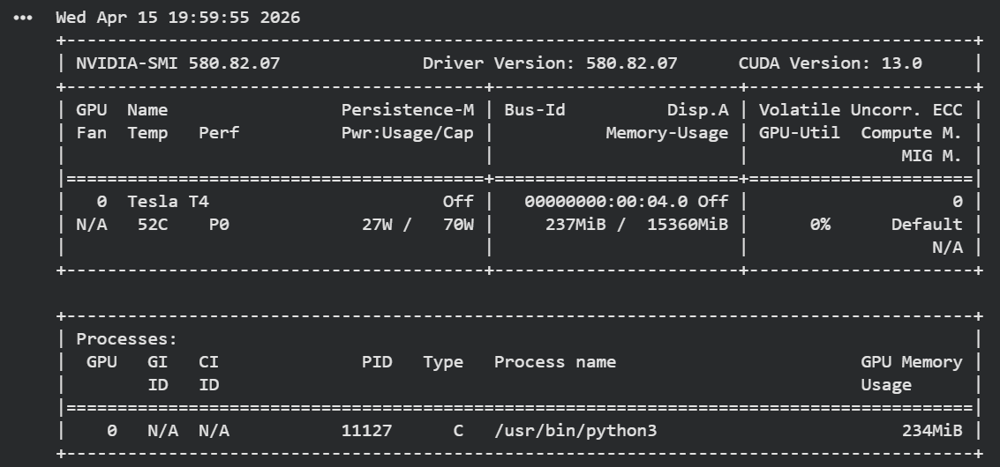
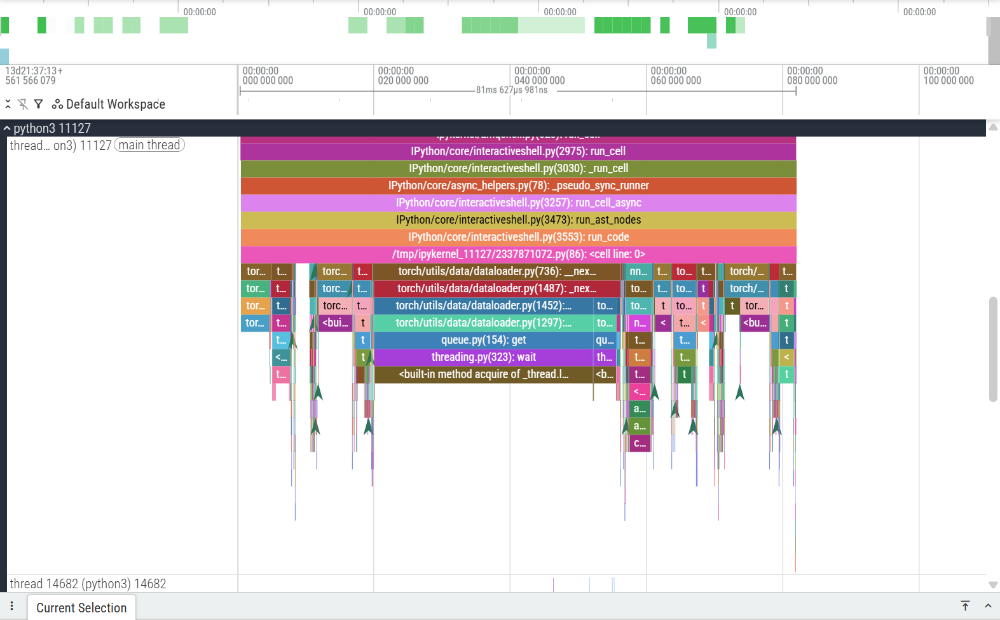
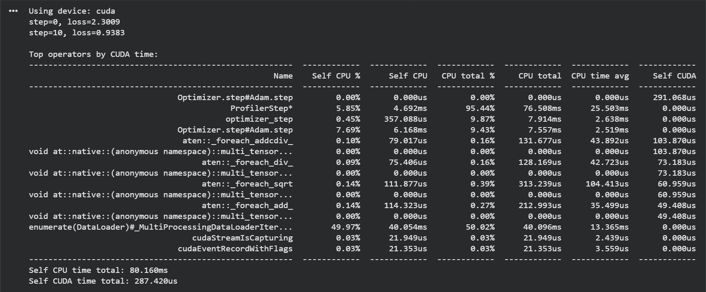

# GPU Profiling using PyTorch Profiler and Perfetto

## Overview

This project demonstrates hands-on GPU profiling of a deep learning training workload using PyTorch Profiler.

The objective is to understand how machine learning models utilize GPU compute resources and identify performance bottlenecks using trace-based profiling tools.

## Tools Used

- PyTorch
- PyTorch Profiler
- Google Colab GPU
- NVIDIA CUDA
- Perfetto Trace Viewer
- nvidia-smi

## Workflow

1. Train neural network on GPU
2. Capture execution trace using torch.profiler
3. Export trace file (.pt.trace.json)
4. Visualize GPU timeline using Perfetto
5. Analyze performance bottlenecks

## Model

Simple feedforward neural network trained on FashionMNIST dataset.

## Profiling Observations

- Forward pass uses matrix multiplication operations (aten::linear)
- Backward pass takes higher compute time
- GPU utilized consistently during training steps
- CPU to GPU transfer latency minimal
- Optimizer step visible in timeline

## Screenshots

### GPU Information


### Perfetto Timeline


### Profiler Output


## Project Structure

```
gpu-profiling-pytorch-lab
│
├── gpu_profiling_lab.ipynb
├── profile_script.py
├── requirements.txt
└── images
```

## Future Improvements

- mixed precision profiling
- larger model profiling
- multi-GPU profiling
- TPU profiling
- distributed training performance analysis

## Key Learning

GPU profiling helps identify compute bottlenecks in ML workloads and improves training efficiency by optimizing batch size, memory usage, and kernel execution patterns.

## Image layout and helper script

PNG images used by notebooks and the README are stored in the `images/` directory at the repository root. If you find PNG files in the repository root, you can run the included helper script to move them safely into `images/`.

To run the script from PowerShell:

```powershell
powershell -NoProfile -ExecutionPolicy Bypass -File .\scripts\fix-images.ps1
```
